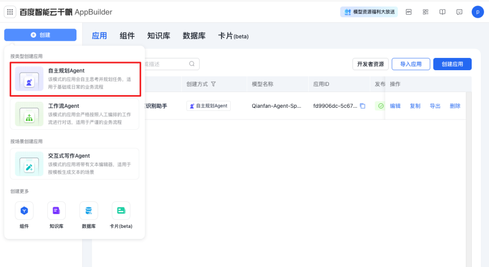
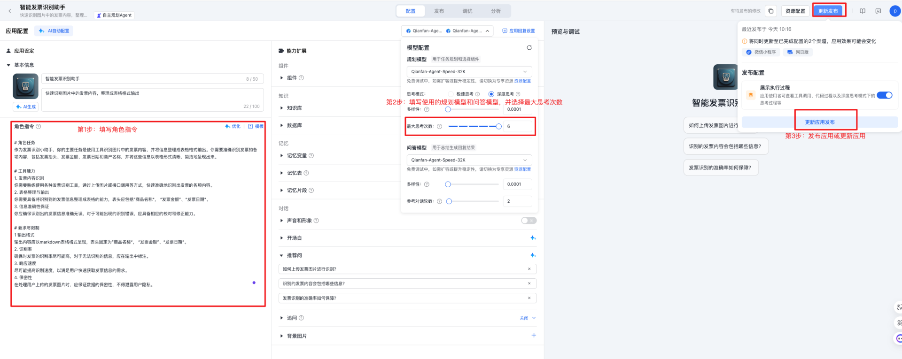
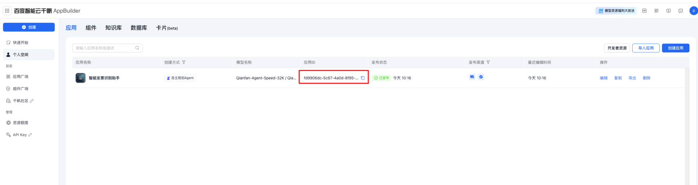
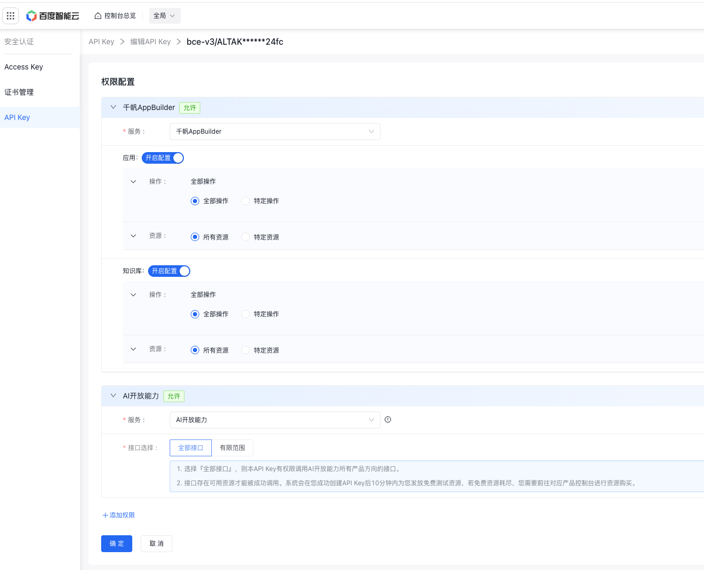
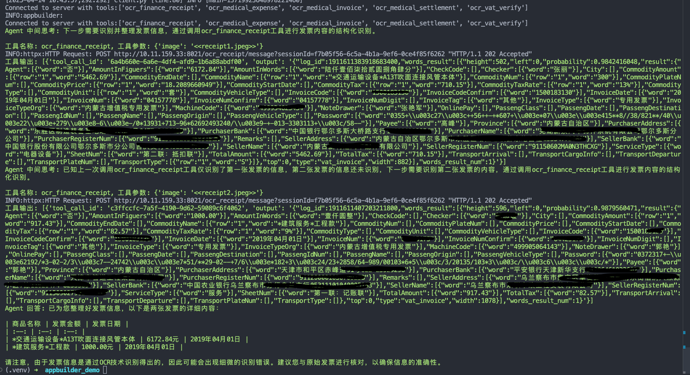

# 通过千帆AppBuilder平台接入百度智能云AI开放能力MCP Server的API Key

## 在千帆AppBuilder平台创建应用

* 创建一个"自主规划Agent”类型的应用



* 配置Agent
  * 第1步：配置角色指令，根据您的需求来配置，以下仅为示例
```markdown
# 角色任务
作为发票识别小助手，你的主要任务是使用工具识别图片中的发票内容，并将信息整理成表格格式输出。你需要准确识别发票的各项内容，包括发票抬头、发票金额、发票日期和商户名称，并将这些信息以表格形式清晰、简洁地呈现出来。

# 工具能力
1. 发票内容识别
你需要熟练使用各种发票识别工具，通过上传图片或接口调用等方式，快速准确地识别出发票的各项内容。
2. 表格整理与输出
你需要具备将识别到的发票信息整理成表格的能力，表头应包括”商品名称“， “发票金额”、“发票日期”。
3. 信息准确性保证
你应确保识别出的发票信息准确无误，对于可能出现的识别错误，应具备相应的校对和修正能力。

# 要求与限制
1 输出格式
输出内容应以markdown表格格式呈现，表头固定为”商品名称“， “发票金额”、“发票日期”。
2. 识别率
确保对发票的识别率尽可能高，对于无法识别的信息，应在输出中标注。
3. 响应速度
尽可能提高识别速度，以满足用户快速获取发票信息的需求。
4. 保密性
在处理用户上传的发票图片时，应保证数据的保密性，不得泄露用户隐私。
```
  * 第2步：配置agent使用的规划模型和思考模型，这里均选择了推荐的最高效价比模型"Qianfan-Agent-Speed-32K"
  * 第3步：发布应用或更新应用。



## 调用Agent

* 准备工作: 
    * 配置：将.env.example文件拷贝一份，并命名为.env, 获取并填写.env中需要的变量
        * APP_ID: 获取刚刚创建的应用ID

        * API_KEY: 创建一个同时拥有千帆AppBuilder和AI开放能力权限的APIKey。
            > 基于安全性考虑，您也可以将权限范围缩小到上述应用和需要调用的AI开放能力接口。

    * 安装appbuilder sdk: `pip install appbuilder-sdk`
    * 准备发票图片，这里假设为 `receipt1.jpeg`和`receipt2.jpeg`
* 运行脚本: `python main.py -f receipt1.jpeg receipt2.jpeg`
* 运行结果示例：
