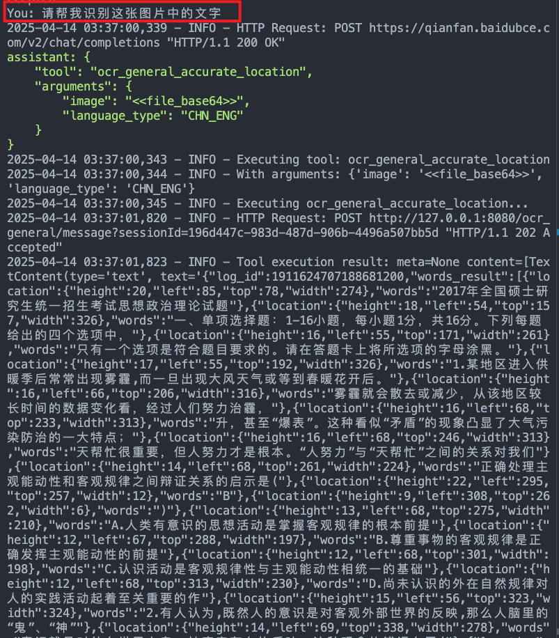
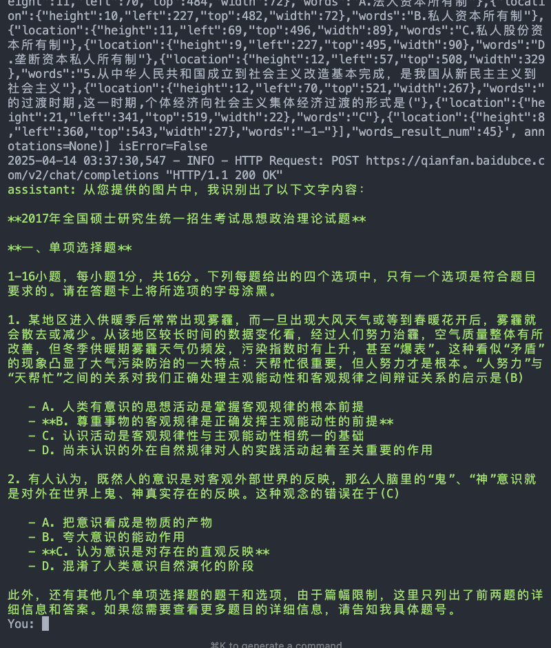

# 通过MCP Python SDK接入百度智能云AI开放能力MCP Server

## 准备工作

* 安装前置依赖: `pip install -r requirements.txt`
* 配置环境变量: 将.env.example文件拷贝一份，并命名为.env, 获取并填写.env中需要的变量
    * LLM_API_KEY: 用于调用大模型的API Key， 您可以使用任何支持OpenAI sdk的大模型服务提供商。
    * LLM_BASE_URL: 用于调用大模型的base url， 例如：https://qianfan.baidubce.com/v2
    * LLM_MODEL: 用于调用大模型的模型名称， 例如：ernie-4.0-turbo-128k
* 配置MCP Server: 将`servers_config.json.example`文件拷贝一份，并命名为`servers_config.json`, 并配置要访问的MCP Server的地址，配置方法参考[百度智能云AI开放能力MCP Server使用指南](https://cloud.baidu.com/doc/AI_REFERENCE/s/Dm9qfl477)

## 运行

* 准备一张需要做OCR识别的图片，假设为`test.jpeg`
* 运行脚本: `python main.py --config servers_config.json --servers ocr_general -f test.jpeg`
* 运行结果示例：

